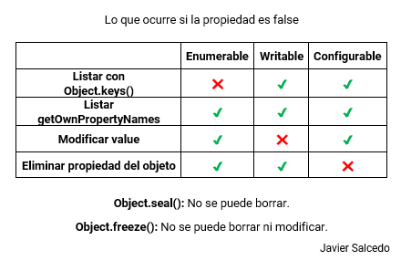
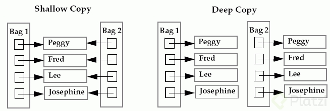

### Object.defineProperty

Con esta propiedad se pueden definir nuevas propiedades a nuestro objeto. Así mismo, se puede configurar ciertas características de la propiedad tales como:

* **Configurable:** Esta indica si la propiedad puede ser borrada o eliminada
* **Enumerable:** Indica si la propiedad puede ser mostrada en la enumeración de las mismas. Existen ciertos métodos que toman como referencia este valor para mostrar la propiedad
* **Writable:** Esta indica si la propiedad puede ser modificada con el operador de asignación (=)

Si queremos modificar un propiedad que tienen `writable: false` no permitirá que su valor sea modificado

`Object.keys` solo muestra las propiedades que tienen `enumerable: true`. A diferencia de `Object.getOwnPropertyNames` que muestra todas las propiedades

Si queremos eliminar propiedad que tienen `configurable: false` no permitirá que sea borrada del objeto.


**Object.freeze()**

Este método *congela* un objeto que sea pasado. Es decir:

* Impide que se le agreguen nuevas propiedades
* Impide que sean eliminas propiedades ya existentes
* Impide que sus las propiedades internas (`writable`, `enumerable` y `configurable`) sean modificadas


**Object.seal()**

Este método *sella* un objeto que sea pasada. Es decir:

* Impide que nuevas propiedades sean agregadas
* Cambia en todas las propiedades `configurable: false`, con lo que impide que sean borradas
* Las propiedades aún puede ser modificadas, ya que `writable` esta `true`

🎳 Las variables son referencias a un espacio en memoria.
🎩 Los navegadores web usan dos tipos de memorias: Stack y Heap.
📁 La memoria Stack es muy rápida, pero sin tanto espacio. Aquí se guardan los valores primitivos (booleanos, strings, números…).
🌪 La memoria Heap es más lenta, pero permite guardar enormes cantidades de información  *(son como los tornados: grandes, lentos y desordenados)* . En esta memoria guardamos los valores de los objetos `({...}`).

Ahora ya entiendo que cuando igualamos una variable a otra estamos igualando al apuntador, por lo tanto si una variable le cambiamos alguna valor de su objeto cambiara para las dos variables, y si esto no es lo que queremos tenemos un problema, pero esto se puede arreglar con shallow copy en JavaScript

### Shallow copy en JavaScript

#### Shallow copy

El **Shallow Copy** *(copia superficial)* es una copia bit a bit de un objeto. Se crea un nuevo objeto que tiene una copia exacta de los valores del objeto original. Si alguno de los campos del objeto son referencias a otros objetos, solo se copian las direcciones de referencia, es decir, solo se copia la dirección de memoria.

```git

```


#### [Object.assign()](https://developer.mozilla.org/en-US/docs/Web/JavaScript/Reference/Global_Objects/Object/assign)

El método Object.assign () copia todas las propiedades propias enumerables de uno o más objetos de origen a un objeto de destino. Devuelve el objeto de destino modificado.

Las propiedades del objeto de destino se sobrescriben con las propiedades de los orígenes si tienen la misma clave. Las propiedades de las fuentes posteriores sobrescriben a las anteriores.

#### [Object.create()](https://developer.mozilla.org/en-US/docs/Web/JavaScript/Reference/Global_Objects/Object/create#specifications)

El método Object.create () crea un nuevo objeto, utilizando un objeto existente como prototipo del objeto recién creado.

#### [La diferencia entre Object.create y Object.assign](https://www.codecalls.com/javascript/difference-between-object-create-and-object-assign/)

La principal diferencia entre **Object.create()** y **Object.assign()** es que el método **Object.assign** crea un nuevo  **Object** . utiliza el objeto proporcionado como prototipo del Objeto recién creado. Mientras que el método **Object.assign()** copia todas las propiedades de los objetos de origen al objeto de destino, que es el primer parámetro de esta función y devuelve este Objeto de destino.

Por lo tanto, vemos que mientras **Object.create()** define propiedades en nuestro **Object** recién creado. **Object.assign()** simplemente asigna el valor de los objetos de origen de destino a nuestro Objeto de destino.

#### Código Clase
